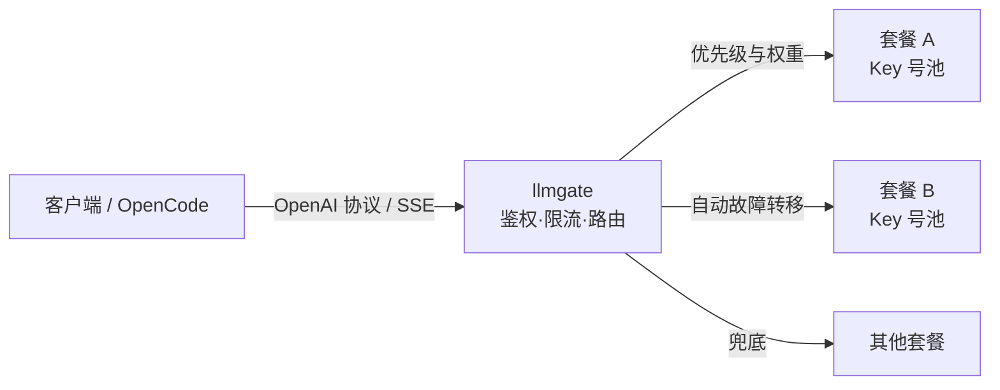

# llmgate

把多个上游大模型**套餐**聚合成一个 **OpenAI 兼容**接口的自用网关（Go + SQLite，单容器，前端嵌入）。



## 思想

- **聚合套餐**：一个对外模型名映射多条「渠道 × 上游模型」，便宜的吃满、贵的兜底
- **可用性优先**：429/余额/5xx/超时自动下沉低优先级；熔断退避 2s→4s→8s 自动回探；流式首个字节前故障转移
- **名字解耦**：上游自动加厂商前缀（`deepseek-v4-flash → deepseek/deepseek-v4-flash`），转发时改写为真实上游名；可建**自定义路由**（一个名挂多个渠道的多个模型）
- **兼容客户端**：白名单透传 `x-opencode-session`、`x-codex-session` 等，缺失自动生成稳定会话 ID，OpenCode 开箱即用
- **安全默认**：每用户独立 `sk-xxx` + 额度上限；API Key AES-256-GCM 加密；停用渠道 → 其下 Key/路由立即失效（启用值独立保存）

## 功能

- **渠道**：多 Key 号池（独立启停/权重/换密钥）、优先级/权重、额外请求头、连通测试
- **路由**：定时自动同步 `/v1/models`、清理下架模型；多条映射按优先级+权重比例分发；熔断故障转移
- **网关**：`/v1/chat/completions`（SSE）· `/v1/completions` · `/v1/embeddings` · `/v1/models`
- **用量**：异步批量落库；仪表盘今日指标/趋势/失败明细；按用户×模型统计，190+ 模型单价估算费用
- **后台**：Dashboard / Channels / Model Routes / Users / Logs / Settings

## 使用

```bash
cp .env.example .env          # 必填 LGM_ADMIN_TOKEN（openssl rand -hex 24）
docker compose up -d --build  # 打开 http://localhost:3210
```

流程：Channels 建渠道（BaseURL + 加号）→ Test 连通 → Sync All Routes 拉模型 → Users 建用户拿令牌 → 客户端调用：

```bash
curl http://localhost:3210/v1/chat/completions \
  -H "Authorization: Bearer sk-你的令牌" -H "Content-Type: application/json" \
  -d '{"model":"deepseek/deepseek-v4-flash","messages":[{"role":"user","content":"你好"}]}'
```

| 环境变量                                                                               | 默认     | 说明                                   |
| ---                                                                                    | ---      | ---                                    |
| `LGM_ADMIN_TOKEN`                                                                      | 必填     | 管理端令牌                             |
| `LGM_HTTP_ADDR`                                                                        | `:3210`  | 监听地址                               |
| `LGM_PROXY`                                                                            | 直连     | 上游出站代理 `socks5://127.0.0.1:7891` |
| `LGM_ENCRYPT_SEED` / `LGM_DB_PATH` / `LGM_GATEWAY_PREFIX` / `LGM_LOG_LEVEL` / `LGM_TZ` | 均有默认 | 见 `.env.example`                      |

详细部署见 [docs/deploy.md](docs/deploy.md)，设计见 [docs/design.md](docs/design.md)。

## License

[MIT](LICENSE) © 2026 马天弋
